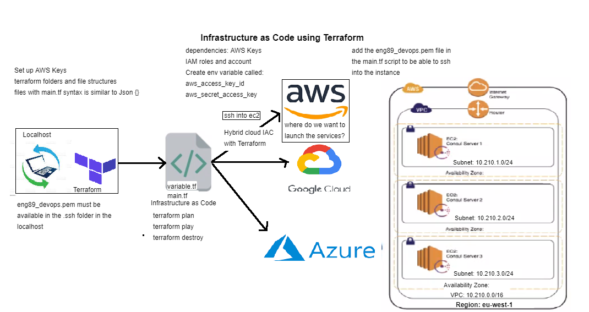
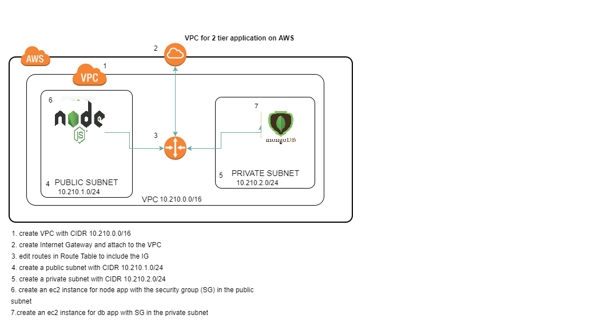

# Infrastructure as Code using Terraform


## Infrastructure as Code
```
Infrastructure as code, also referred to as IaC, is an IT practice that codifies and manages underlying IT infrastructure as software.
```
### IaC Advantages
- Speed and efficiency
`Automated provisioning and management are faster and more efficient than manual processes.`
- Consistency
`Software developers can use code to provision and deploy servers and applications according to business practices and policies, rather than rely on system administrators in a DevOps environment.`
- Alignment with DevOps
`With the infrastructure setup written as code, it can go through the same version control, automated testing and other steps of a continuous integration and continuous delivery (CI/CD) pipeline that developers use for application code.`

## Terraform installation and setting up the path in the env variable
- Securing AWS keys with Terraform
- Setting Env variables for our AWS secret and access keys
- On windows click on windows keys and type settings
- Windows
- In Search, search for and then select: System (Control Panel)
- Click the Advanced system settings link.
- Click Environment Variables. ...
- In the Edit System Variable (or New System Variable) window, specify the value of the PATH environment variable. ...
- Name env variables as AWS_ACCESS_KEY_ID for secret key AWS_SECRET_ACCESS_KEY

## Let's create our Terraform env to access our AMI to launch ec2 instance
### Terrafrom commands:
- terraform init: initialises the terraform with required dependencies of the provider mentioned in the main.tf 

- terraform plan
- terraform apply
- terraform destroy
```python
# Let's build a script to connect to AWS and download/setup all dependencies required 

# Provide a region
provider "aws" {
        region = "eu-west-1"
}


# VPC 
resource "aws_vpc" "terraform_vpc" {
  cidr_block       = var.cidr_block_0 
  instance_tenancy = "default"
  # enable_dns_support = true
  # enable_dns_hostnames = true
  
  tags = {
    Name = var.vpc_name
  }
} 


# INTERNET GATEWAY
resource "aws_internet_gateway" "terraform_igw" {
  vpc_id = aws_vpc.terraform_vpc.id
  
  tags = {
    Name = var.igw_name
  }
}


#  PUBLIC SUBNET
resource "aws_subnet" "app_subnet" {
    vpc_id = aws_vpc.terraform_vpc.id
    cidr_block = var.cidr_block_1
    map_public_ip_on_launch = "true" 
    availability_zone = "eu-west-1a"
    tags = {
        Name = var.pub_subnet_name
    }
}


#  Private SUBNET
resource "aws_subnet" "db_subnet" {
    vpc_id = aws_vpc.terraform_vpc.id
    cidr_block = var.cidr_block_2
    map_public_ip_on_launch = "true" 
    availability_zone = "eu-west-1a"
    tags = {
        Name = var.pri_subnet_name
    }
}


# ROUTE TABLE

resource "aws_route_table" "terra_route_table" {
    vpc_id = aws_vpc.terraform_vpc.id

    route {
        cidr_block = "0.0.0.0/0"
        gateway_id = aws_internet_gateway.terraform_igw.id
    }
    tags = {
        Name = "eng89_niki_terra_RT"
    }
}

resource "aws_route_table_association" "terra_assoc_RT" {
    subnet_id = aws_subnet.app_subnet.id
    route_table_id = aws_route_table.terra_route_table.id
}


# SECURITY GROUPS
resource "aws_security_group" "pub_sec_group" {
      
  name        = "eng89_prathima_terra_app"
  description = "app security group"
  vpc_id =    aws_vpc.terraform_vpc.id


  ingress {                         # allow to ssh into instance
    from_port   = 22
    to_port     = 22
    protocol    = "tcp"
    cidr_blocks = [var.my_ip] # MY IP
    }

  ingress {                           # allow  for nginx
    from_port   = "80"
    to_port     = "80"
    protocol    = "tcp"
    cidr_blocks = ["0.0.0.0/0"]
    }


  ingress {                         # reverse proxy
    from_port   = 3000
    to_port     = 3000
    protocol    = "tcp"
    cidr_blocks = ["0.0.0.0/0"]
    }

  egress {                          # allow all outbound traffic 
    from_port  = 0
    to_port    = 0
    protocol   = -1
    cidr_blocks = ["0.0.0.0/0"]
  }

  tags = {
   Name = "eng89_prathima_terra_public_SG"
  }
}


resource "aws_security_group" "pri_sec_group" {
      
  name        = "eng89_prathima_terra_db"
  description = "db security group"
  vpc_id =    aws_vpc.terraform_vpc.id


  ingress {                         # allow to ssh into instance
    from_port   = 22
    to_port     = 22
    protocol    = "tcp"
    cidr_blocks = [var.my_ip] # MY IP
    }

  

  ingress {                           # reverse proxy
    from_port   = 27017
    to_port     = 27017
    protocol    = "tcp"
    cidr_blocks = ["10.210.1.0/32"]
    }

  egress {                          # allow all outbound traffic 
    from_port  = 0
    to_port    = 0
    protocol   = -1
    cidr_blocks = ["0.0.0.0/0"]
  }

  tags = {
   Name = "eng89_prathima_terra_private_SG"
  }
}


# NETWORK ACLs
resource "aws_network_acl" "public_nacl" {
  vpc_id = aws_vpc.terraform_vpc.id

  
  ingress {
      protocol   = "tcp"
      rule_no    = 100
      action     = "allow"
      cidr_block = "0.0.0.0/0"
      from_port  = 80
      to_port    = 80
    }


  ingress {
      protocol   = "tcp"
      rule_no    = 120
      action     = "allow"
      cidr_block = var.my_ip # MY IP
      from_port  = 22
      to_port    = 22
    }

  egress {
      protocol   = "tcp"
      rule_no    = 110
      action     = "allow"
      cidr_block = "0.0.0.0/0"
      from_port  = 80
      to_port    = 80
    }

  egress {
      protocol   = "tcp"
      rule_no    = 120
      action     = "allow"
      cidr_block = "10.201.2.0/24"
      from_port  = 27017
      to_port    = 27017
    }


  tags = {
    Name = "eng89_terra_prathima_nACL_pub"
  }
}

# NETWORK ACLs
resource "aws_network_acl" "private_nacl" {
  vpc_id = aws_vpc.terraform_vpc.id

  
  ingress {
      protocol   = "tcp"
      rule_no    = 100
      action     = "allow"
      cidr_block = var.my_ip
      from_port  = 22
      to_port    = 22
    }


  ingress {
      protocol   = "tcp"
      rule_no    = 110
      action     = "allow"
      cidr_block = var.cidr_block_2 # DB
      from_port  = 27017
      to_port    = 27017
    }

  
  ingress {
      protocol   = "tcp"
      rule_no    = 120
      action     = "allow"
      cidr_block = "0.0.0.0/0" 
      from_port  = 1024
      to_port    = 65535
    }

ingress {
      protocol   = "tcp"
      rule_no    = 130
      action     = "allow"
      cidr_block = "0.0.0.0/0" 
      from_port  = 80
      to_port    = 80
    }

ingress {
      protocol   = "tcp"
      rule_no    = 140
      action     = "allow"
      cidr_block = "0.0.0.0/0" 
      from_port  = 443
      to_port    = 443
    }


  egress {
      protocol   = "tcp"
      rule_no    = 100
      action     = "allow"
      cidr_block = "0.0.0.0/0"
      from_port  = 80
      to_port    = 80
    }

  egress {
      protocol   = "tcp"
      rule_no    = 110
      action     = "allow"
      cidr_block = "10.201.2.0/24"
      from_port  = 1024
      to_port    = 65535
    }


  tags = {
    Name = "eng89_terra_prathima_nACL_pri"
  }
}


# APP INSTANCE
resource "aws_instance" "app_instance" {
ami                 = var.app_ami_id
instance_type       = "t2.micro"

subnet_id = aws_subnet.app_subnet.id
associate_public_ip_address = true


vpc_security_group_ids = ["${aws_security_group.pub_sec_group.id}"]


tags = {
      Name = var.app_name   
 }

 key_name = var.aws_key_name # goes to varaible.tf file


# connection {
#  type        = "ssh"
#  user        = "ubuntu"
#  private_key = file("${var.aws_key_path}")
#  host        = self.associate_public_ip_address
# }

}

# DB INSTANCE
resource "aws_instance" "db_instance" {
ami                 = var.db_ami_id
instance_type       = "t2.micro"

subnet_id = aws_subnet.db_subnet.id
associate_public_ip_address = true


vpc_security_group_ids = ["${aws_security_group.pri_sec_group.id}"]


tags = {
      Name = var.db_name   
 }

 key_name = var.aws_key_name # goes to varaible.tf file


}
```
### variable.tf
```python
  
# let's create variable fo rour resources in mian.tf to make use of DRY


variable "cidr_block_0" {
  default="10.210.0.0/16"
}


variable "cidr_block_1" {
  default="10.210.1.0/24"
}


variable "cidr_block_2" {
  default="10.210.2.0/24"
}


variable "vpc_name" {
  default = "eng89_prathima_terra_vpc"
}


variable "pub_subnet_name" {
  default = "eng89_prathima_terra_subnet_public"
}

variable "pri_subnet_name" {
  default = "eng89_prathima_terra_subnet_private"
}

variable "vpc_id" {

  default = "vpc-07e47e9d90d2076da"
}


variable "igw_name" {
  default = "eng89_prathima_terra_IG"
}


variable "app_ami_id" {
  default="ami-026754d4887301d2a" # ansible app ami
}

variable "db_ami_id" {
  default="ami-08abee4e4ddf9b9ba" # ansible app ami
}

# Let's creatge a variable to apply DRY

variable "app_name" {
  default="eng89_prathima_terra_app"
}
variable "db_name" {
  default="eng89_prathima_terra_db"
}

variable "my_ip" {

  default = "[my_ip]/32"

}

variable "aws_key_name" {
  default = "eng89_prathima1"
}

variable "aws_key_path" {

  default = "~/.ssh/eng89_prathima1.pem"
}
```
### Let's run the main.tf as below:
- terraform plan #checks the syntax errors
- terraform apply #builds the resources from the code
